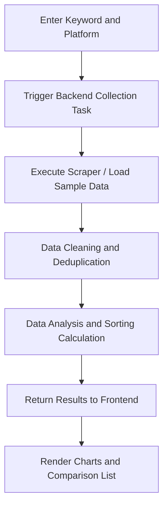

## 1. Product Overview
This project is an automated e-commerce product price data collection and comparison analysis tool.
- It is primarily used to batch scrape key information such as product name, price, sales volume, rating, and link from specified social e-commerce platforms (like t.me, instagram.com, linkedin.com, x.com) based on keywords.
- It provides functions like data cleaning, deduplication, price sorting, horizontal comparison, price trend charts, and value-for-money recommendation labels to help users with market analysis and shopping decisions.

## 2. Core Features

### 2.1 User Roles
| Role | Registration Method | Core Permissions |
|------|---------------------|------------------|
| Normal User | No registration required | Search products by keyword, view data charts and comparison results, run scraper script |

### 2.2 Feature Modules
1. **Console/Home (Dashboard)**: Contains search configuration bar, real-time execution status display, and core metric cards.
2. **Data Analysis and Comparison Page**: Contains a price-sorted list, horizontal product comparison view, and price trend charts (line chart/bar chart).

### 2.3 Page Details
| Page Name | Module Name | Feature Description |
|-----------|-------------|---------------------|
| Console | Search Module | Supports keyword input, target platform selection, triggers scraping script execution |
| Console | Execution Status | Displays real-time execution progress or console logs of the scraping script |
| Analysis Page | List Module | Presents cleaned and deduplicated product data, supporting low-to-high price sorting |
| Analysis Page | Comparison & Charts | Provides multi-product horizontal comparison table, price distribution chart, and value recommendation badges |

## 3. Core Process
Users enter keywords and select platforms on the page. The system calls the backend script to execute the scraper (if real-time scraping is restricted, it loads the built-in sample dataset). After data collection, cleaning, deduplication, and analysis are completed, the results are returned to the frontend for rendering and display.

## 4. User Interface Design
### 4.1 Design Style
- Theme Color: Modern tech feel, predominantly Dark Mode, supplemented with highlight accent colors (such as neon green or electric blue) to emphasize "best value" and key chart data.
- Buttons & Interaction: Subtle hover animations, flat design with slight Neon effect.
- Typography: Uses modern sans-serif fonts like Inter or Roboto; numbers use Monospace fonts for better price alignment and readability.
- Layout Style: Dashboard style, card-based layout, high information density but clearly structured.

### 4.2 Page Design Overview
| Page Name | Module Name | UI Element Design |
|-----------|-------------|-------------------|
| Console | Search Area | Centered large input box with a glowing "Run Script" button and tech-style borders |
| Console | Data Display Area | Data Cards, using Recharts to render dynamic charts, with high-value badges |

### 4.3 Responsive Design
- Prioritizes desktop widescreen display for complex tables and charts, while providing adaptive folding charts and scrollable tables for mobile devices.
