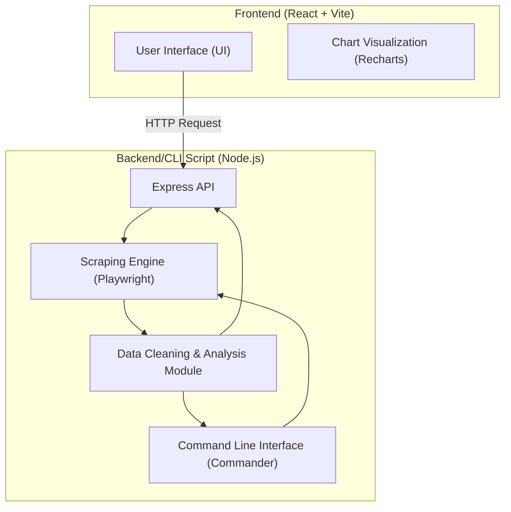

## 1. Architecture Design

## 2. Technology Stack Description
- **Frontend**: React@18 + TailwindCSS@3 + Vite + Recharts (for price trends and data visualization) + Lucide React (icons)
- **Backend/Script**: Node.js + Express (provides Web API) + Playwright (for simulated browser scraping) + Commander (for CLI building)
- **Data Processing**: Native JS array processing (cleaning, deduplication, sorting)
- **Initialization Tools**: Vite for frontend, npm init for backend

## 3. Routes and API Definitions
| Route/API | Method | Purpose |
|-----------|--------|---------|
| `/` | GET | Frontend Dashboard Page |
| `/api/crawl` | POST | Receives keywords, triggers the scraping script, and returns the analyzed JSON result |
| `/api/sample` | GET | Retrieves the initialized sample dataset for display |

## 4. Core Logic (Data Fetching & Processing)
1. **Collection Layer**: Based on the input keyword, constructs search URLs for corresponding platforms (t.me, instagram, etc.). Uses Playwright to render pages and extract key node data (like name, price, sales volume, rating).
2. **Cleaning Layer**: Filters invalid prices and empty names; unifies price units and formats; deduplicates based on product links or name hashes.
3. **Analysis Layer**: Sorts by price from low to high; calculates average price and rating value scores; applies tags like `Best Value` / `Trending`.

## 5. Command Line Interface (CLI) Design
- Command Format: `npx tsx cli.ts search <keyword> --platforms t.me,x.com`
- Output Format: Prints formatted tables in the console (using `cli-table3`), displaying the sorted product list and recommendation labels.
